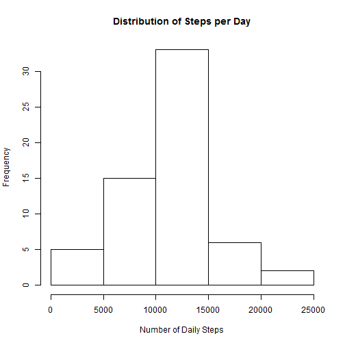

This project reports on a simple analysis of data from a personal activity monitoring device.


## Loading and preprocessing the data  

We begin by loading the dplyr and lubridate packages and reading the data from the zip file. Then we force the "date" column to be of type "Date", and create a new column, day.of.week, using the lubridate "wday" function. The resulting values will be 1 for Sunday, 2 for Monday, et cetera.


```r
library(dplyr)
library(lubridate)

if (!file.exists("activity.csv")){
    unzip("activity.zip")
}

mydata <- read.table("activity.csv",header=TRUE,sep=",")
          
mydata$date <- as.Date(as.character(mydata$date))

mydata <- mutate(mydata,day.of.week = wday(date))
```

## What is mean total number of steps taken per day?  

We use dplyr functions to calculate the number of steps taken on each day of the study, then calculate a histogram, the mean, and the median for the resulting values. We use Scott's rule for creating buckets for the histogram.


```r
daily.data <- group_by(mydata,date) %>%
              summarise(steps = sum(steps))


hist(daily.data$steps,breaks="Scott",
     xlab="Number of Daily Steps",
     main ="Distribution of Steps per Day")
```

 

```r
mean(daily.data$steps,na.rm=TRUE)
```

```
## [1] 10766.19
```

```r
median(daily.data$steps,na.rm=TRUE)
```

```
## [1] 10765
```

## What is the average daily activity pattern?

We calculate the average number of steps taken during each time interval, averaged over all days. In order to insure that equal time inverals will be equally spaced along the horizontal axis, when graphing we express each interval with hours as the unit, including a fractional part. Otherwise, for example, the space between 1055 and 1100 will be greated than the space between 1100 and 1105, even though both represent 5-minute intervals.


```r
interval.data <- group_by(mydata,interval) %>%
                 summarise(steps = mean(steps,na.rm=TRUE))

x <- (interval.data$interval) %/% 100 + ((interval.data$interval) %% 100)/60
y <- interval.data$steps

plot(x,y,type="l",xlab="Time Interval",ylab="Average Number of Steps")
```

 

We also identify the interval with the largest average number of steps, and the corresponding value.


```r
interval.data$interval[y==max(y)]
```

```
## [1] 835
```

```r
max(y)
```

```
## [1] 206.1698
```


## Imputing missing values  

First we calculate the number of data points with missing values.


```r
sum(is.na(mydata$steps))
```

```
## [1] 2304
```


Since our analysis will look at activity patterns on different days of the week, we take averages over interval/weekday pairs and use these as our imputed values.


```r
impute <- group_by(mydata,interval,day.of.week) %>%
          summarise(steps = mean(steps,na.rm=TRUE))
          
clean <- inner_join(mydata,impute,by=c("interval","day.of.week"))  %>%
         mutate(steps=ifelse(is.na(steps.x),steps.y,steps.x))
```


```r
clean.daily.data <- group_by(clean,date) %>%
                    summarise(steps = sum(steps))

hist(clean.daily.data$steps,breaks="Scott",
     xlab="Number of Daily Steps",
     main ="Distribution of Steps per Day")
```

 

```r
mean(clean.daily.data$steps,na.rm=TRUE)
```

```
## [1] 10821.21
```

```r
median(clean.daily.data$steps,na.rm=TRUE)
```

```
## [1] 11015
```

Our method for imputing values has very little effect on the mean, but it increases the median. In the histogram, it substantially increases the count in the 10000 to 15000 step bucket.

## Are there differences in activity patterns between weekdays and weekends?  

We load the ggplot2 library and add a factor variable the the "clean" data frame that will differentiate weekends from weekdays. This variable is used in the panel plot that displays the different patterns for weekdays and weekends.


```r
library(ggplot2)

clean <- mutate(clean,we=ifelse(day.of.week==1 | day.of.week==7,"weekend","weekday")) %>%
         group_by(interval,we) %>%
         summarise(steps = mean(steps)) %>%
         mutate(contin.interval = (interval) %/% 100 + ((interval) %% 100)/60)

g <- ggplot(clean,aes(contin.interval,steps))

g + 
    geom_line() +
    facet_grid(we~.)
```

 

This plot suggests that on weekends the person's activity started later in the day, but there are more midday spikes, e.g. intervals where the average number of steps taken exceeded 100.

